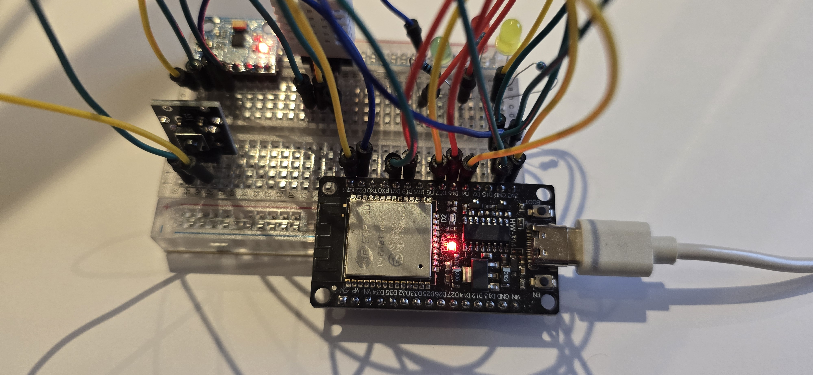
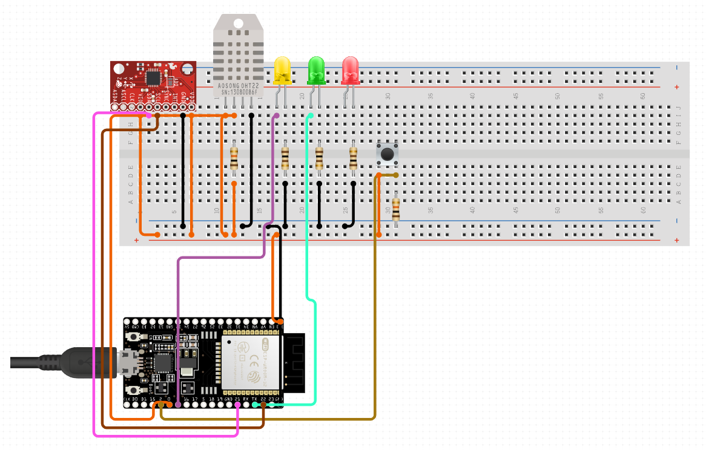

# ESP32 Sensor Project


[](https://github.com/PascualF/esp32-sensor-project/actions)
[](https://esp32sensorsproject-default-rtdb.europe-west1.firebasedatabase.app/)  


This project uses an **ESP32** with a **DHT22** (temperature & humidity) and an **MPU6050** (accelerometer + gyroscope).
It reads sensor values, logs them, and can send alerts over WiFi.

---
## Project Description
This project monitors vibration, temperature, and humidity using an ESP32 connected to DHT22 and MPU6050 sensors.  
It demonstrates sensor fusion, environmental data collection, and IoT communication.  
The system can later send alerts to Firebase or Telegram when vibration thresholds are exceeded.

---
## Features
- Real-time sensor readings (temperature, humidity, acceleration)
- LED indicators for alerts
- Button input to simulate events
- WiFi connectivity (HTTP or MQTT)
- Firebase and Telegram alert integration
- Expandable for predictive maintenance use

## Components
- ESP32 DevKit
- DHT22
- MPU6050 accelerometer/gyroscope module
- Breadboard + jumper wires (testing phase)

## Wiring
### DHT22
| Pin  | ESP32  |
|------|--------|
| VCC  | 3.3V   |
| GND  | GND    |
| DATA | GPIO 4 |

### MPU6050
| Pin | ESP32   |
|-----|-------- |
| VCC | 3.3V    |
| GND | GND     |
| SDA | GPIO 21 |
| SCL | GPIO 22 |

## Setup
### Breabboard Photo


### Wiring Diagram


## Bill of Materials (BOM)
The full Bill of Materials is available in [`docs/bom.xlsx`](Docs/BOM.xlsx).

---

## Code
The Arduino sketch is in [Firmware/ESP32/main/main.ino](Firmware/ESP32/main/main.ino).

---

## Data Format Example

# Average 15 minutes temperature
```json
"device01": {
  "averages" : {
    "-O_NxB7VCkW7m_lBEx26" : {
      "avgHum": 61.99133,
      "avgTemp": 23.72945,
      "timestamp": 1758134059,
    }
  },
  "heartbeat" : {
    "-O_nFbWNQbXw72EmTbkn" : {
      "status": "alive",
      "timestamp": 175857359,
    }
  },
  "vibration_events" : {
    "-O_OG6esCcKkfJVZqZte" : {
      "level": "ORANGE",
      "magnitude": 2.451,
      "timestamp": 1758139283,
    }
  },
}
```

## How to run
1. Install Arduino IDE and ESP32 board support.
2. Install required libraries:
    - `DHT sensor library`
    - `Adafruit Unified Sensor`
    - `MPU6050_light`
3. Open `src/main.ino`.
4. Select your ESP32 board and correct COM port.
5. Upload the code to the ESP32.
6. Open Serial Monitor at `115200 baud`.

## Env. Variables

```
WIFI_SSID=your_wifi_name
WIFI_PASSWORD=your_wifi_password
FIREBASE_API_KEY=your_api_key
FIREBASE_URL=your_firebase_url
TELEGRAM_TOKEN=your_bot_token
TELEGRAM_CHATID=your_chat_id

```

## Author
Pascual Felicio
📍 Brussels, Belgium
📧 pascualfelicio@gmail.com

## Future Plans
- WiFi data transfer (MQTT / Firebase)
- Improve Web dashboard for live visualization (React / Next.js)
- Predictive maintenance using sensor trends
- Improve Email / Telegram alerts for anomalies
- Possibility for expansion with more sensors (pressure, gas, etc.)
